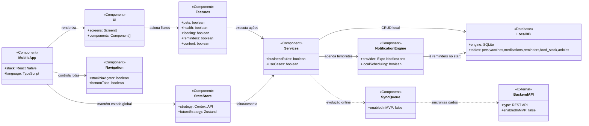

# UML da Aplicação (Componentes)

Este diagrama representa a arquitetura principal do Gateiro App no MVP, com foco em mobile local-first e evolução futura para backend.

## Observações

- Fonte de verdade no MVP: `LocalDB (SQLite)`.
- O `BackendAPI` não é obrigatório para a versão inicial.
- A sincronização (`SyncQueue`) é uma camada de evolução, sem quebrar o modo offline-first.
